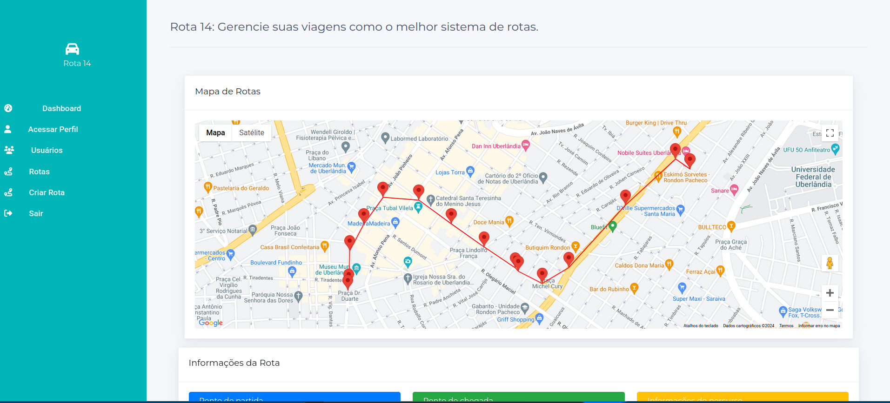

## 
<div style="display: flex; align-items: center;">
  
  <span style="margin-left: 10px; font-size: 24px; font-weight: bold;">Rota 14</span>
</div>
<hr>

Seja bem-vindo ao repositório da aplicação Rota 14. Esta aplicação consiste em um sistema de gerenciamento de rotas, onde os usuários podem criar rotas de forma dinâmica e simples.



## Arquitetura da Aplicação:

A arquitetura da aplicação é composta por uma arquitetura cliente-servidor, onde temos o cliente sendo o front-end da aplicação e o back-end sendo o servidor, além do banco de dados para a persistência dos dados.

## Tecnologias Utilizadas no Projeto:

Para a criação da arquitetura da aplicação foram utilizados:

- Docker
- Docker Compose

Para o Front-end da aplicação foram utilizados:

- Angular 17
- HTML
- CSS
- TypeScript
- Bootstrap 5
- Google Maps API

Para o Back-end da aplicação foram utilizados:

- Python 3+
- Flask
- Marshmallow
- SQLAlchemy

Para o Banco de Dados da aplicação foi utilizado:

- PostgreSQL

## Rodando o Projeto:

### Dependências:

É necessário ter instalado o Docker e o Docker Compose no seu computador para rodar o projeto.

Para isso, acesse: [Instalar Docker](https://docs.docker.com/engine/install/) e [Instalar Docker Compose](https://docs.docker.com/compose/install/).

Além disso, é necessário ter uma chave de API do Google Maps API para rodar o projeto. 

Para obter a chave, acesse: [Obter chave Google Maps API](https://developers.google.com/maps/get-started?hl=pt-br).

### Configurando o Projeto:

1. Com sua chave de API configurada, acesse o arquivo em **platform-test/Front-End/src/environment/environment.ts** e coloque sua chave de API no campo **apiKey**:

```typescript
export const environment = {
  production: false,
  apiUrl: "http://localhost:5000/",
  apiKey: "sua chave de api",
};
```

2.Apos isso acesse o arquivo em <b>platform-test/Front-End/src/index.html</b> e adicione sua chave de api no script que está na linha 8 do arquivo.

```
 <script src="https://maps.googleapis.com/maps/api/js?key=SUA_CHAVE_API&libraries=visualization"></script>

```

### Configurando o projeto:

Por fim dentro da pasta do projeto,execulte os comandos:

```
 docker build
```

```
 docker compose
```

Se tudo ocorrer bem voce deve ser capaz de acessar aplicação no seu navegador acessando a rota:


```
 http://localhost:4201/
```


